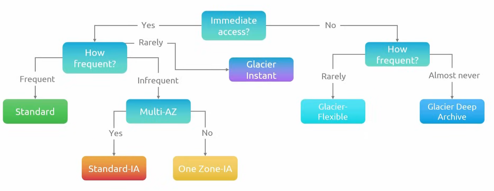

# Amazon Cloud Storage Services

## Overview

AWS provides a range of cloud storage solutions designed to meet different use cases, including object storage, block storage, file storage, and archival storage. Each service is optimized for specific access patterns, durability requirements, latency characteristics, and cost considerations.

Understanding these storage services is foundational for designing scalable, reliable, and cost-efficient cloud architectures.

## Storage Categories in AWS

AWS storage services can be broadly categorized into four types:

1. **Block Storage**
2. **File Storage**
3. **Object Storage**
4. **Archival Storage**

Each category aligns with different system design requirements.

---

## Amazon EBS (Elastic Block Store)

### Definition

Amazon EBS provides block-level storage volumes that can be attached to EC2 instances.

### Key Characteristics

- Persistent storage for EC2
- Low-latency access
- Suitable for transactional workloads
- Bootable FS, tied to a specific EC2 instance
  - EBS & EC2 must be located within the same AZ

### Volume Types

- **General Purpose SSD (gp2/gp3)**: Balanced performance and cost
- **Provisioned IOPS SSD (io1/io2)**: High-performance workloads
- **Throughput Optimized HDD (st1)**: Large sequential workloads
- **Cold HDD (sc1)**: Lowest cost, infrequent access

### Use Cases

- **Databases**
- Boot volumes for EC2
- Applications requiring consistent low latency

---

## Amazon EFS (Elastic File System)

### Definition

Amazon EFS is a fully managed file storage service that provides shared file access across multiple EC2 instances.

### Key Characteristics

- Supports Network File System (NFS)
- Multiple clients/instances can simultaneously access the same data
- Automatically scales storages
- Non-bootable FS

### Use Cases

- Content management systems
- Shared development environments
- Big data analytics workloads

---

## Amazon FSx

### Definition

Amazon FSx provides fully managed file systems optimized for specific workloads.

### Variants

- **FSx for Windows File Server**
- **FSx for Lustre** (high-performance computing)

### Use Cases

- Windows-based applications
- HPC workloads
- Machine learning pipelines

---

## Amazon S3 (Simple Storage Service)

### Definition

- Amazon S3 is an object storage service that stores data as objects within buckets
- S3 is a standalone service that can be accessed over the internet
- You cannot edit objects *in-place*, they must be retrieved then stored again to override the original object
- S3 has a flat file structure, meaning that everything is stored at the same level / folder and therefore **cannot be mounted or booted**
- Great for storing *logs* and *media* files
  - S3 can reduce the cost of loading these files into servers and is much more efficient for scaling

### Key Characteristics

- Virtually unlimited storage capacity
- High durability (11 9’s, or 99.999999999%)
- Accessible via HTTP/HTTPS APIs
- Designed for scalability and high availability

### Use Cases

- Static website hosting
- Data lakes
- Backup and restore
- Media storage

### Core Concepts

- **Bucket**: A container for storing objects
- **Object**: The actual data (file + metadata)
- **Key**: Unique identifier for an object within a bucket

### Storage Classes

S3 provides multiple storage classes optimized for different use cases all with 11 9's of durability:

- **S3 Standard**: Frequently accessed data that is immediately available across multiple AZs
- **S3 Standard-IA**: Infrequent access with lower cost
- **S3 One Zone-IA**: Lower cost, single AZ storage.
- **S3 Glacier Instant**: Archival storage. Low-cost option for rarely accessed data with the same performance as S3 standard. (Think *Backups*)
- **S3 Glacier Flexible**: Cold-start archival storage that requires time to access.
- **S3 Glacier Deep Archive**: Lowest-cost long-term storage meant for data that is never needed (think *Compliance*)
- **S3 Intelligent-Tiering**: Automatic cost optimization

*Note:* Storage costs are all measured in GB stored / month.
| Storage Class | Fault Tolerance | Outflow Cost | Additional Comments |
| --- | --- | --- | --- |
| S3 Standard (Default) | can handle two simultaneous AZ failures | Egress fee per GB outbound | Most expensive tier |
| S3 Standard-IA | can handle two simultaneous AZ failures | Egress fee per GB outbound + 90day duration charge + retrieval fee + minimum file size charge | Cheaper storage cost than S3 Standard, but can be more expensive if too frequently accessed |
| S3 One Zone-IA | stored on only 1 AZ  | GB / mo | Egress fee per GB outbound + 90day duration charge + retrieval fee + minimum file size charge | Data does not require handling AZ failure, but keep in mind that replication still occurs within AZ. |
| S3 Glacier Instant | can handle two simultaneous AZ failures | Egress fee per GB outbound + 90day duration charge + retrieval fee + minimum file size charge | Cheaper than S3 Standard and S3 Standard-IA, but has a higher retrieval cost and longer minimum duration |
| S3 Glacier Flexible | can handle two simultaneous AZ failures | Egress fee per GB outbound + 90day duration charge + retrieval fee + minimum file size charge | Cheaper than all of the above, comes in 3 options for data retrieval speed *(Expedited, Standard, Bulk)* |
| S3 Glacier Deep Archive | can handle two simultaneous AZ failures | Egress fee per GB outbound + 90day duration charge + retrieval fee + minimum file size charge | Cheapest storage class but requires the most amount of time to access, comes in 2 options for data retrieval speed *(Standard, Bulk)* |
| S3 Intelligent-Tiering | | Storage class costs are still applied | Additional monitoring/automation cost per 1000 objects |

#### Storage Class Decision Tree

  

---

## Storage Comparison

| Feature            | S3 (Object)        | EBS (Block)        | EFS (File)         |
|-------------------|------------------|-------------------|-------------------|
| Access Type       | API (HTTP)       | Attached to EC2   | Shared file system |
| Scalability       | Unlimited        | Limited per volume| Elastic           |
| Latency           | Moderate         | Low               | Moderate          |
| Use Case          | Static/data lake | Databases         | Shared workloads  |

---

## Durability and Availability

- **S3**: Replicated across multiple Availability Zones
- **EBS**: Replicated within a single AZ
- **EFS**: Regional, multi-AZ design

Durability and redundancy strategies vary depending on service type and pricing model.

---

## Security Considerations

- Encryption at rest and in transit
- IAM-based access control
- Bucket policies (S3)
- Security groups and network controls (EBS/EFS)

---

## Key Design Trade-offs

When choosing a storage solution, consider:

- Access pattern (frequent vs infrequent)
- Latency requirements
- Cost constraints
- Scalability needs
- Data sharing requirements

---

## Summary

AWS provides a comprehensive suite of storage services tailored to different application needs:

- **EBS** for high-performance block storage
- **EFS** for shared file systems
- **S3** for scalable object storage
- **Glacier** for archival storage

Selecting the correct storage service is a fundamental system design decision that directly impacts performance, cost, and scalability.

---

## 📚 References

### 🌐 Online
- [AWS Storage - EBS vs S3 vs EFS](https://youtu.be/6vNC_BCqFmI?si=mN_8ivUIXfNRD4Yt) – *AWS with Chetan*
- [AWS Storage Explained | EBS vs EFS vs S3](https://youtu.be/C9StEK6EMQY?si=bISyYGGKabftYnVl) – *KodeKloud*
- [AWS S3 Tutorial, Creating a Bucket](https://youtu.be/mDRoyPFJvlU?si=P4cOip8B7sZtsdGK) – *Tiny Technical Tutorials*

### 📖 Books
- **The Self-Taught Cloud Computing Engineer** | Chapter 2: Amazon Cloud Storage Services — *Dr. Logan Song*  